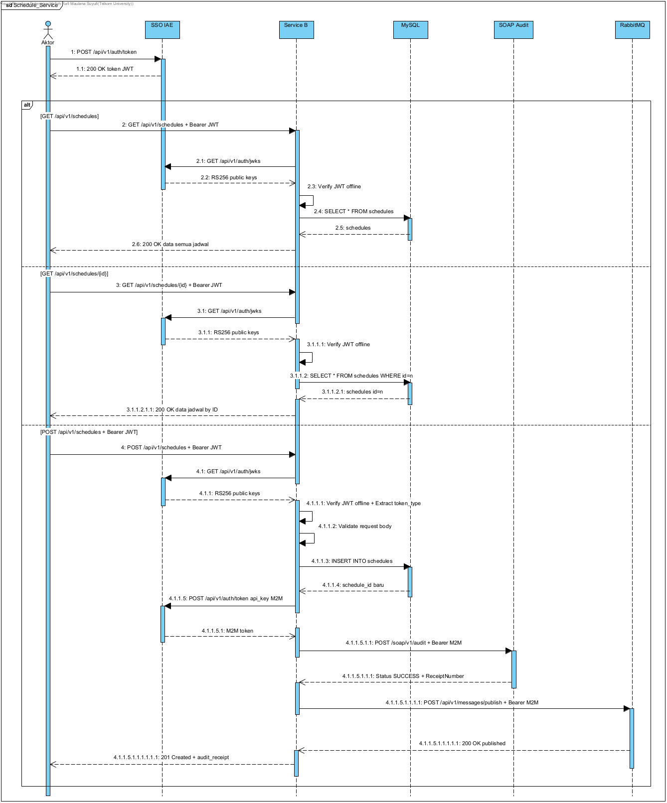

# Analisis Tugas 3 — Service B: Penjadwalan Driver

**Nama:** Hafizh Rafi Maulana Suyufi  
**NIM:** 102022400210  
**Kelompok:** Group 7 — Pencatatan Operasional Pengisian BBM  
**Service:** Service B — Penjadwalan Driver (Laravel 13, PHP 8.4)

---

## 1. Alur Bisnis yang Dikerjakan

Service B bertanggung jawab dalam mengelola data penugasan driver untuk operasional pengisian bahan bakar dalam ekosistem Group 7. Dispatcher atau admin operasional membuat jadwal driver melalui sistem; setelah jadwal tersimpan, sistem secara otomatis mencatat transaksi ke IAE Legacy Audit System melalui SOAP dan menyebarkan informasi jadwal kepada layanan lain melalui message broker.

Service C (Monitoring BBM) mengonsumsi informasi jadwal tersebut secara tidak langsung untuk memvalidasi bahwa driver yang hendak melakukan pengisian BBM memang tercatat bertugas pada hari tersebut, sehingga klaim yang tidak sah dapat dicegah.

```
Dispatcher / Admin Operasional
        ↓  Membuat jadwal driver
Service B — Penjadwalan Driver
        ↓  Simpan ke database (MySQL)
        ↓  SOAP Audit → IAE Legacy System        [non-blocking]
        ↓  Publish Event → IAE Message Broker    [non-blocking]
        ↓
Service C (Monitoring BBM)   ←  Konsumsi event schedule.created
Service A (Data Kendaraan)   ←  Konsumsi event schedule.created
```

---

## 2. Pemilihan Transaksi Penting dan Transaksi yang Harus Disebarkan

Service B menyediakan tiga endpoint REST API:

| Endpoint | Method | Jenis Operasi |
|----------|--------|---------------|
| `/api/v1/schedules` | GET | Read-only |
| `/api/v1/schedules/{id}` | GET | Read-only |
| `/api/v1/schedules` | POST | Write — transaksi kritis |

**`POST /api/v1/schedules`** dipilih sebagai transaksi penting yang memerlukan SOAP Audit sekaligus transaksi yang harus disebarkan via Message Broker. Kedua endpoint GET bersifat read-only, tidak mengubah state, sehingga tidak memerlukan audit maupun broadcasting.

---

## 3. Alasan Pemilihan

### 3.1 SOAP Audit

Pembuatan jadwal driver bersifat satu kali data tersimpan ke database, tidak ada rollback otomatis. Jadwal yang tersimpan secara langsung membuka akses driver untuk menggunakan kendaraan dan melakukan pengisian bahan bakar atas biaya perusahaan. Tanpa audit terpusat, tidak ada jejak siapa yang membuat jadwal dan kapan, yang membuka celah pembuatan jadwal fiktif. SOAP Audit bersifat non-blocking; kegagalan pengiriman tidak membatalkan transaksi utama.

### 3.2 Event Broadcasting (Message Broker)

Service C membutuhkan data jadwal dari Service B untuk validasi pengisian BBM. Jika komunikasi dilakukan secara langsung, gangguan pada Service C akan ikut menghentikan proses pembuatan jadwal. Pendekatan berdasarkan kejadian memutus ketergantungan tersebut: Service B hanya perlu mempublikasikan event `schedule.created`, sedangkan Service C dan Service A mengonsumsinya secara tidak langsung. Event publishing juga bersifat non-blocking.

### 3.3 Ringkasan

| Kriteria | Penjelasan |
|----------|------------|
| **State-changing** | INSERT ke database — mengubah state sistem secara permanen |
| **Irreversible** | Tidak ada rollback otomatis → butuh audit trail |
| **Dampak finansial** | Jadwal tidak sah = kerugian biaya BBM perusahaan |
| **Ketergantungan antar service** | Service C dan A butuh data jadwal yang selalu terkini |
| **Decoupling** | Event messaging cegah saling bergantung, tingkatkan ketahanan sistem |

---

## 4. Batasan Service

| Aspek | Batasan |
|-------|---------|
| **Domain data** | Hanya jadwal driver; tidak mengelola kendaraan, user, atau BBM |
| **Autentikasi** | Delegasi penuh ke IAE SSO (`iae-sso.virtualfri.id`); tidak ada auth mandiri |
| **Role akses** | Semua JWT valid dari SSO diizinkan; tidak ada pembedaan role di level aplikasi |
| **Audit** | Non-blocking producer only; tidak ada retry otomatis |
| **Messaging** | Non-blocking producer only; tidak mengelola consumer |
| **Infrastruktur** | Satu container Docker (port 8000); satu database MySQL |

---

## 5. Sequence Diagram


| Langkah | Aktor | Protokol | Endpoint | Keterangan |
|---------|-------|----------|----------|------------|
| 1 | Client → SSO | HTTPS/REST | `POST /api/v1/auth/token` | Mendapatkan JWT |
| 2 | Client → Service B | HTTPS/REST | `GET` atau `POST /api/v1/schedules` | Request utama |
| 3 | Service B → SSO | HTTPS/REST | `GET /api/v1/auth/jwks` | Verifikasi JWT offline (cached) |
| 4 | Service B → MySQL | TCP | `INSERT INTO schedules` | Simpan data (POST only) |
| 5 | Service B → SSO | HTTPS/REST | `POST /api/v1/auth/token` | Ambil M2M token (POST only) |
| 6 | Service B → SOAP | HTTPS/SOAP | `POST /soap/v1/audit` | Audit log — non-blocking (POST only) |
| 7 | Service B → MQ | HTTPS/REST | `POST /api/v1/messages/publish` | Publish event — non-blocking (POST only) |
| 8 | Service B → Client | HTTPS/REST | — | Respons akhir (201 / 200 / 4xx) |
